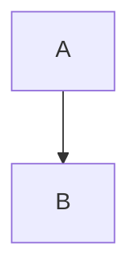

# 一级标题 使用一个#

## 二级标题 使用两个#

### 三级标题 使用三个#

#### 四级标题 使用四个#

##### 五级标题 使用五个#

###### 六级标题 使用六个#

最多支持六个#

### 初始化一张空白图片

`*```mermaid 敲击回车即可*` 

### 流程图

在空白图片处输入 graph TD;


```mermaid
graph TD;
	A-->B;
```


